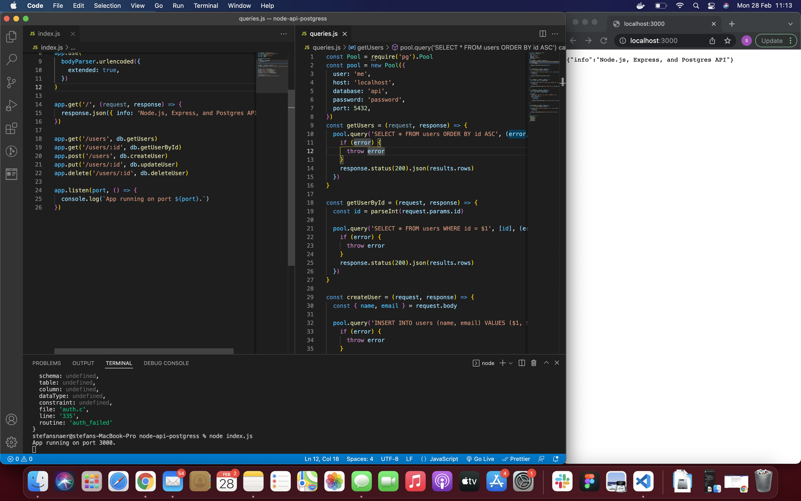

## Back-end - REST API

I followed the tutorial at ( https://blog.logrocket.com/nodejs-expressjs-postgresql-crud-rest-api-example/#settingupanexpressjsserver ) starting at Setting up an Express.js server witch was the minimum requirement for this project.

## Knowledge

# Understanding the crud operations

CRUD stands for Create, Read, Update and Delete - the four major functions to interact with databases.

- Create = Adds entries
- Read = Retrieves entries
- Update = Changes spescific fields in existing entries
- Delete = Removes on or more existing entries

# Understand http requests and how to handle them

A http (Hypertext Transfer Protocol) request is made by a client to a host and the aim is to access a resource on the server. The most common http methods are Get, Head and Post.

# Understand different types of requests and map them to corresponding database request

- GET
  The GET method requests a representation of the specified resource. Requests using GET should only retrieve data.

- HEAD
  The HEAD method asks for a response identical to a GET request, but without the response body.

- POST
  The POST method submits an entity to the specified resource, often causing a change in state or side effects on the server.

- PUT
  The PUT method replaces all current representations of the target resource with the request payload.

- DELETE
  The DELETE method deletes the specified resource.

- CONNECT
  The CONNECT method establishes a tunnel to the server identified by the target resource.

- OPTIONS
  The OPTIONS method describes the communication options for the target resource.

- TRACE
  The TRACE method performs a message loop-back test along the path to the target resource.

- PATCH
  The PATCH method applies partial modifications to a resource.
